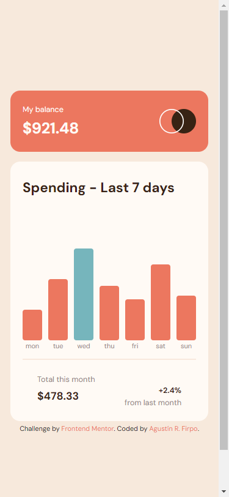
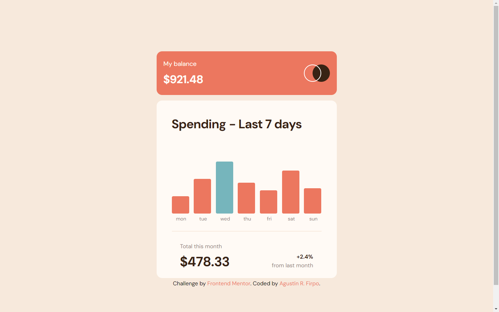

Hi everybody! 👋

# Frontend Mentor - Expenses chart component solution

This is a solution to the [Expenses chart component challenge on Frontend Mentor](https://www.frontendmentor.io/challenges/expenses-chart-component-e7yJBUdjwt).

## Table of contents 🧾

- [Overview](#overview)
  - [The challenge](#the-challenge)
  - [Screenshot](#screenshot)
  - [Links](#links)
- [My process](#my-process)
  - [Built with](#built-with)
  - [What I learned](#what-i-learned)
  - [Continued development](#continued-development)
  - [Useful resources](#useful-resources)
- [Author](#author)
- [Acknowledgments](#acknowledgments)

## Overview

### The challenge 🎯

Users should be able to:

- View the bar chart and hover over the individual bars to see the correct amounts for each day


- See the current day’s bar highlighted in a different colour to the other bars


- View the optimal layout for the content depending on their device’s screen size



- See hover states for all interactive elements on the page


- **Bonus**: Use the JSON data file provided to dynamically size the bars on the chart


### Links 🔗

- Solution: [Github Repository](https://github.com/Arfirpo/expenses-chart-component-main)
- Solution: [Github Page](https://arfirpo.github.io/expenses-chart-component-main/)

## My process ⚙️

### Built with 🛠️

- Semantic HTML5 markup
- CSS custom properties
- Flexbox
- [Sass](https://sass-lang.com/) - Css preprocessor
- Mobile-first workflow
- Javascript - for the bar functionality and JSON data file

### What I learned 📚

This challenge allowed me to consolidate and expand my knowledge in javascript, especially in:
-work with data from a json file
-Management of events.
-Functions of validation.
-Creation of regular expressions.
-Manipulation of the DOM.

In turn, this was the first project using SASS to style my html, getting into the use of:
-Nestings
-Partial
-Mixins
-Extends

```js
// importing a json file to javascript
import data from '../data.json' assert {type: 'json'};
console.log(data);
}

// obtaining the values to modify the height of each bar
let maxValue = Math.max(...values);
let maxHeightBar = 150;
console.log(maxValue);

let bars = document.querySelectorAll('.bars__grafics-chart');
bars = [...bars];

bars.forEach(bar =>{
    let newValue = parseFloat(bar.childNodes[1].innerText);
    let actualHeight = (newValue * maxHeightBar) / maxValue;

// dynamically modifying the height of each bar
    bar.style.height = `${actualHeight}px`;
    if(newValue == maxValue){
        bar.style.backgroundColor = 
        'hsl(186, 34%, 60%)';
// making the label appear with the value of each bar when the mouse is passed 
    bar.addEventListener('mouseover', event=>{
        if(event.target.className == 'bars__grafics-chart'){
            let labelElement = event.target.childNodes[1];
        labelElement.style.display = 'block';
        }
    });
// making the label disappear with the value of each bar when the mouse leaves 
    bar.addEventListener('mouseout', event=>{
        if(event.target.className == 'bars__grafics-chart'){
            let labelElement = event.target.childNodes[1];
        labelElement.style.display = 'none';
        }
    });
})
```

## Author 🙋🏻‍♂️

- Twitter/X - [@agus_firpo](https://twitter.com/agus_firpo)
- Frontend Mentor - [@Arfirpo](https://www.frontendmentor.io/profile/Arfirpo)
- Linkedin - [Agustín Rodrigo Firpo](https://www.linkedin.com/in/agustin-rodrigo-firpo-0aa86697/)
